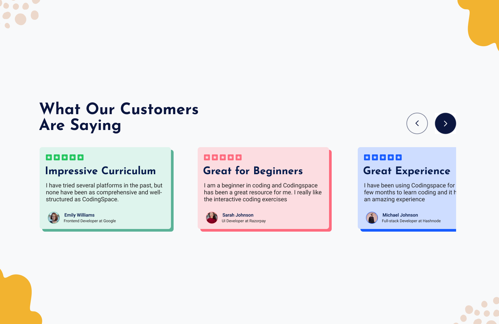

**Challenge Title**
Testimonials UI Component

**Challenge Description**
In this challenge, you'll build a Testimonials UI Component. This challenge is perfect for you if you're interested in building interactive front-end web components and taking your web dev skills to the next level!

**Difficulty Level**
Intermediate

**Tags**
FRONTEND

**Learning**
In this frontend challenge, you'll learn how to use CSS Grid/Flexbox to layout the Testimonials UI component. You'll also learn how to use DOM manipulation to make the component interactive and dynamic. This challenge is a great opportunity to improve your skills and build something cool. You're going to love it!

**Text**
Testimonial 1

heading: Impressive Curriculum
paragraph: I have tried several platforms in the past, but none have been as comprehensive and well-structured as CodingSpace.
name: Emily Williams
designation: Frontend Developer at Google

Testimonial 2

heading: Great for Beginners
paragraph: I am a beginner in coding and Codingspace has been a great resource for me. I really like the interactive coding exercises
name: Sarah Johnson
designation: UI Developer at Razorpay

Testimonial 3

heading: Great Learning Experience
paragraph: I have been using Codingspace for the past few months to learn coding and it has been an amazing experience
name: Michael Johnson
designation: Full-stack Developer at Hashnode

**Requirements**

- Navigate between different testimonials by clicking on the arrow buttons
- Use CSS to style the component to make it look similar to the design provided
- Responsive design to support different screen sizes.

**Taking your Project to the Next Level**

- User can navigate between testimonials using the arrow keys.
- Use a framework like React, Vue, or Svelte. Or, if you're feeling particularly adventurous, try writing everything in Vanilla JavaScript.

I hope you'll enjoy building this challenge.

Feel free to share your solution on the website or on social media and tag [us](https://twitter.com/codingspace30).
